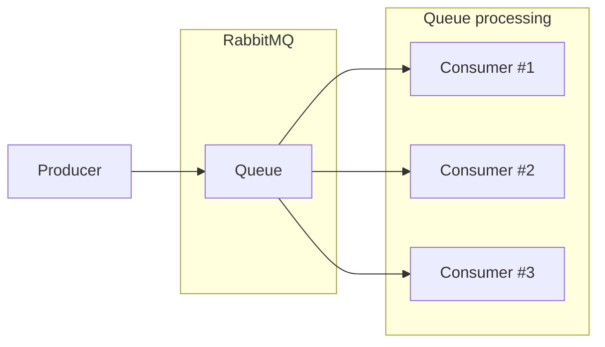
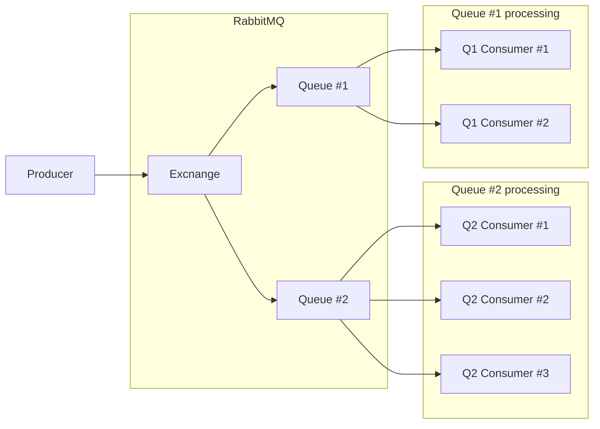

# RabbitMQ using examples

The repository contains two sample examples of RabbitMQ using on C#.

## Competing consumers pattern
A producer sends a message to a queue.
One or many consumers request a message from the queue. Only one consumer can process the message. Many consumers allow the processing of messages with horizontal scaling

## Fanout exchange using
The producer sends a message into an exchange.  
Consumers register a queue, that is bound to the exchange.  
There is the ability to register and bind many queues that allow consumers to process one message.  
More that one consumer can be attached to a queue for horizontal scaling.

